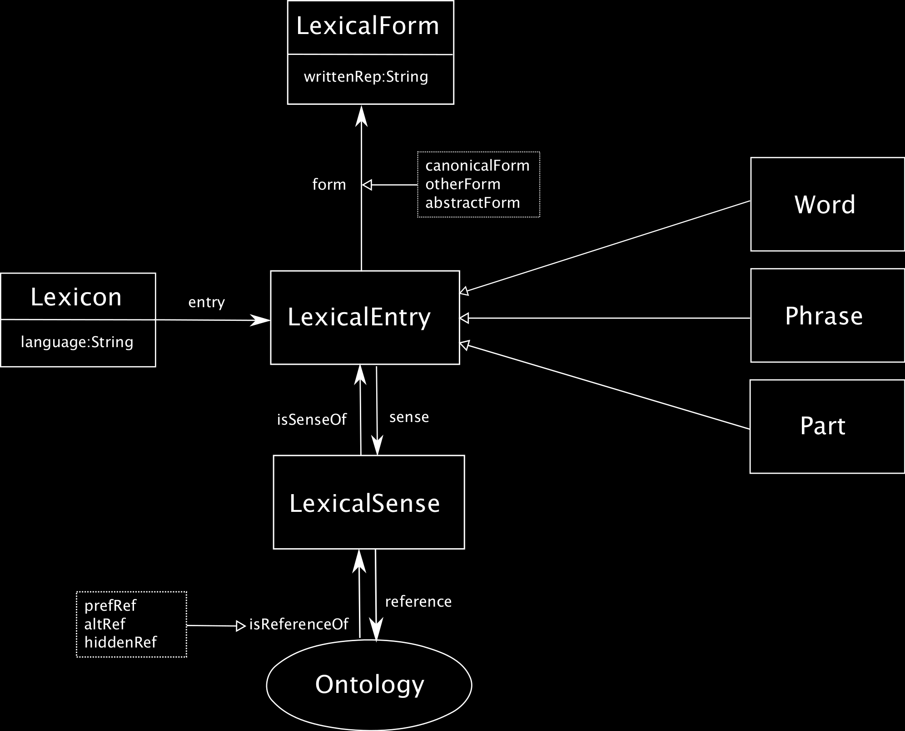
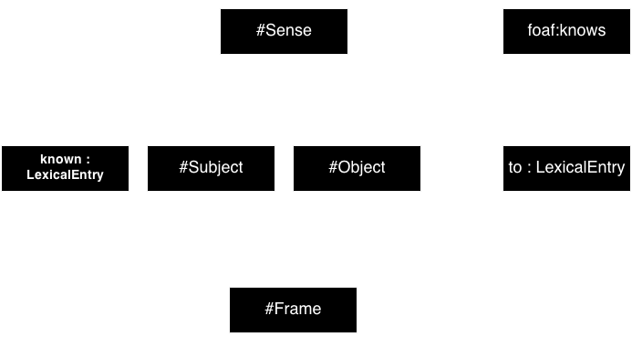

% Modelling the Semantics of Adjectives in the Ontology-Lexicon Interface
% John P. McCrae1, Francesca Quattri2, Christina Unger1 and Philipp Cimiano1 
% 1Universit&auml;t Bielefeld, 2Hong Kong Polytechnic University

# Introduction

* Ontology-lexica separate the lexical and ontological layer
* Many beautiful linguistic theories:

> Fail decidedly when it comes to adjectives (Bankston, 2003)

* Does the OntoLex model fail too?

# Question Answering over Linked Data

What is the highest mountain in Australia?

 

    SELECT DISTINCT ?uri WHERE { 
      ?uri rdf:type dbo:Mountain . 
      ?uri dbo:locatedInArea res:Australia . 
      ?uri dbo:elevation ?elevation . 
    } ORDER BY DESC(?elevation) LIMIT 1

# OntoLex _lemon_

* Model for representing lexical information relative to ontologies
* Consists of **Lexical Entry**
    * Morphosyntactic annotation
* Each of which may have **Lexical Form**
    * Individual morphemes
* And any number of **Lexical Senses**
    * Lexico-semantic annotations
    * Reference to an ontological concept

# Classification of adjectives

# Classifications of adjectives

* Intersective: $X\mathrm{~is~a~}A~N \Rightarrow X\mathrm{~is~}A \wedge  X\mathrm{~is~a~}N$
* Subsective: $X\mathrm{~is~a~}A~N \Rightarrow X\mathrm{~is~a~}N$, but $X\mathrm{~is~a~}A~N \not\Rightarrow X\mathrm{~is~}A$
* Privative: $X\mathrm{~is~a~}A~N \not\Rightarrow X\mathrm{~is~a~}N$
* Gradable: We can express ‘$X$ is $A$-er than $Y$’
* Operator: Modify the qualia structure of the adjective
* Object-Relational: Can express a relationship between two or more entities (e.g., with prepositional adjunct)

# Intersective adjectives

# Object-relational adjectives

# Gradable adjectives

* Frequently fuzzy
* Observable, related to some property
* Converse pairs (e.g., ‘big’/‘small’)
* Or absolutes (e.g., ‘red’)
* Non-monotonic (is a ‘big Yorkshire Terrier’ a ‘big dog’)
    * Often varies with time, e.g., for tallness

# Gradable adjectives versus OWL

* OWL (Web Ontology Language) is a decidable subset of FOL (first-order logic)
    * Not fuzzy
    * Strictly monotonic
* The representation of gradable adjectives is fundamentally impossible

# PANIC!

# Pseudo-classes

* There have been attempts to extend OWL beyond FOL
    * Rule Interchange Format
    * Probabilistic OWL
* We provide a practical vocabulary, that can interface with these system, e.g.,
    
<pre>
:high_pseudo_class
  rdfs:subClassOf oils:CovariantScalar ;
  oils:boundTo dbpedia:elevation ;
  oils:degree oils:strong .
</pre>

# Supervaluation and defaults

* Include default values on ontological classes

<pre>
sumo:Book oils:default [
    oils:defaultFor sumo:height ;
    oils:defaultMin "10in" ;
    oils:defaultMax "11in" ] 
</pre>

* Easy interpretation of adjectives 
* Requires defaults for each class
    * These should be inferable from examples

# Operators

* Operators change the meaning of the noun
    * e.g., a ‘fake gun’ is not a ‘gun’
* Higher-order operations e.g.,
    $\mathrm{fake} = \lambda C \lambda x [fake(C)](x)$

# Adjectives in Question Answering

* We analyzed 250 questions in QALD-4 dataset
    * 76 contained adjectives
* 18 no semantic contribution 
    * “official website” &rarr; `dbo:website`
* 13 intersective adjectives
    * “Danish” &rarr; $\exists$ `dbo:country`.`res:Denmark`

# Adjectives in Question Answering (II)
* 27 gradable adjectives
    * “high” &rarr; `dbo:elevation`
    * “highest” &rarr; `dbo:highestPlace`
* 3 operator adjectives, primarily disambiguators
    * “professional Surfer” &rarr; `dbo:occupation=res:Surfing`
* 8 non-ontological adjectives
    * “same”, “other”

# Conclusion

# Conclusions

* Adjectives are more challenging to resolve as
    * Non-monotonic
    * Fuzzy
    * Higher-order
* OWL and other FOL not sufficient for full natural language
* Ontology-lexicon models such as _lemon_ are extensible with non-FOL ontologies

# Thanks

Thank you for your attention!

Images from WikiMedia

Share these slides: 
<a href="http://jmccrae.github.io/cogalex-adjectives/">http://jmccrae.github.io/cogalex-adjectives</a>

